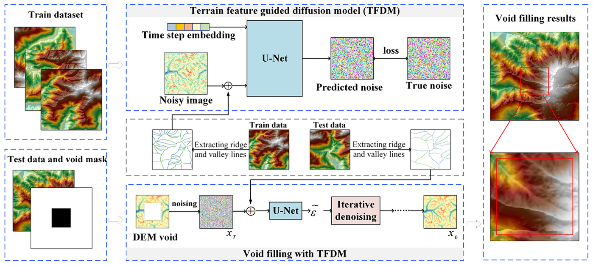

# Void Filling of Digital Elevation Models Based on Terrain Feature-Guided Diffusion Model


[](https://doi.org/10.1016/j.rse.2024.114432)

This repository contains the official implementation of the paper:

**Void filling of digital elevation models based on terrain feature-guided diffusion model**
*Remote Sensing of Environment (RSE), 2024*

---

## Introduction


Digital Elevation Models (DEMs) are essential for topographic and geomorphological studies. However, voids in DEMs cause loss of terrain details and reduce their applicability.

Traditional interpolation methods degrade in accuracy and struggle with complex terrain. GAN-based methods improve performance but are prone to artifacts and elevation jumps near voids.

We propose a **Terrain Feature-Guided Diffusion Model (TFDM)** for DEM void filling. By constraining the diffusion process with terrain feature lines, TFDM generates seamless DEM surfaces and preserves terrain contours.

---


## Training

Train the diffusion model with:

```bash
python train.py --conf_path confs/train.yml
```

---

## Testing & Evaluation

Run evaluation on test DEMs:

```bash
python test.py --conf_path confs/dem_eval.yml
```


---

## Citation

If you use this code in your research, please cite:

```bibtex
@article{zhao2024void,
  title={Void filling of digital elevation models based on terrain feature-guided diffusion model},
  author={Zhao, Ji and Yuan, Yingying and Dong, Yuting and Li, Yaozu and Shao, Changliang and Yang, Haixia},
  journal={Remote Sensing of Environment},
  volume={309},
  pages={114432},
  year={2024},
  publisher={Elsevier}
}

```

---

## Acknowledgements

This work is inspired by and builds upon the following:

- [RePaint: Inpainting using Denoising Diffusion Probabilistic Models](https://arxiv.org/abs/2201.09865)  
  *Andreas Lugmayr, Martin Danelljan, Andres Romero, Fisher Yu, Radu Timofte, Luc Van Gool, Computer Vision Lab, ETH Zürich, Switzerland*  

- [OpenAI Guided Diffusion](https://github.com/openai/guided-diffusion)


---

